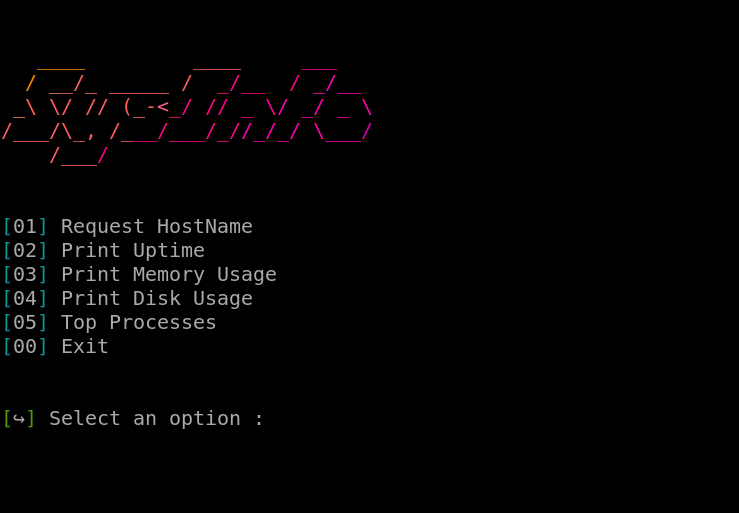

# ABOUT

~ `sysinfosh` is sys-made script which gives you options that are easy to use to get info about you Linux-System!

~ It's simple to use and simple to get informations back!

-----
# REQUIREMENTS

~ `Git` - **Newest version**

~ `NeoFetch` - **If you dont have this command, our script will install it for you!**

-----
# CLONING

~ To clone this ripository, simply type:

    git clone https://github.com/tkmeza/sysinfosh.git

-----
# USAGE

~ Enter a directory:

    cd sysinfosh

~ Run script:

    bash sysinfo.sh
~ Or:

    bash raw.sh

~ Enter a `digit` next to a `action` that you wan't to perform!

~ All `instructions` all on the screen!

~ Script made for printing Linux-System information!

-----
# PREVIEW

~ Here is the preview of the script:

# LICENSE

~ `MIT LICENSE`

`tkemza`

